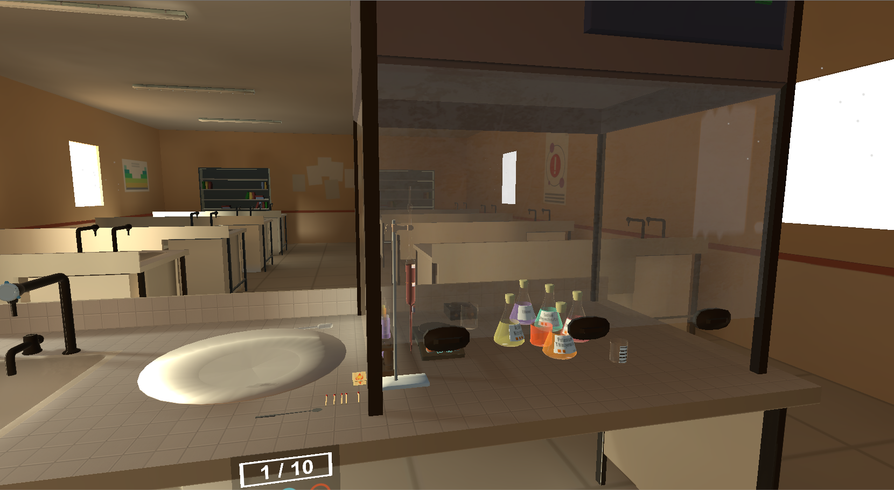
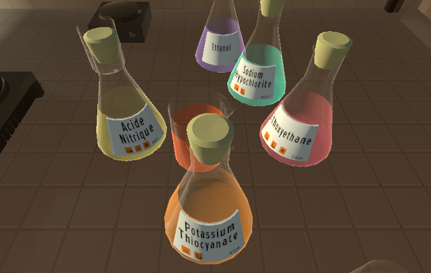
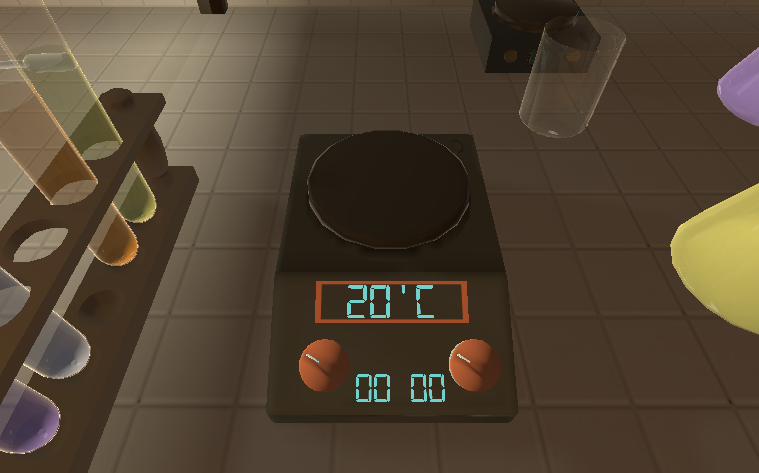
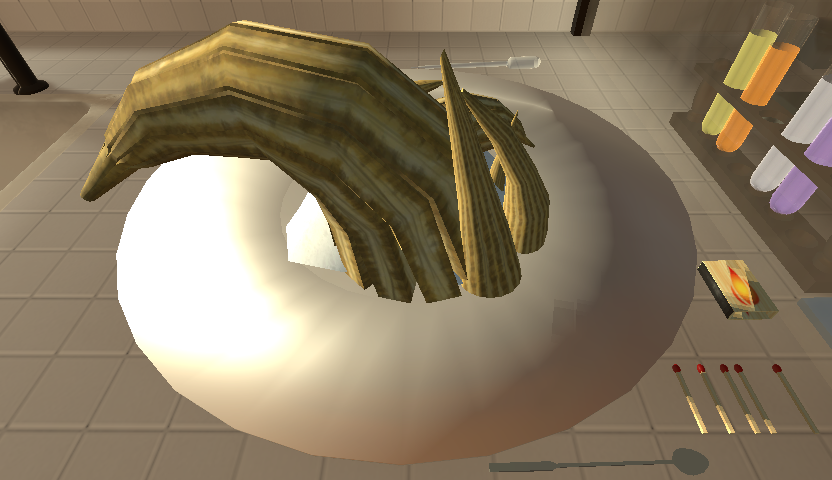
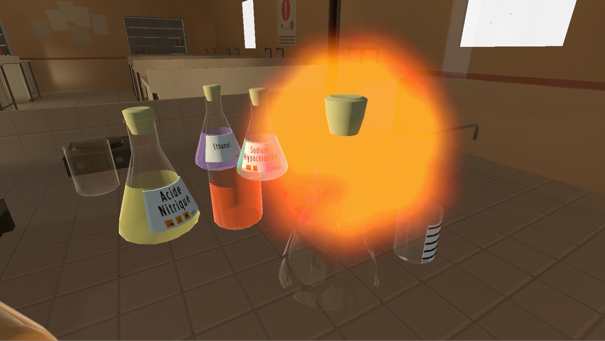
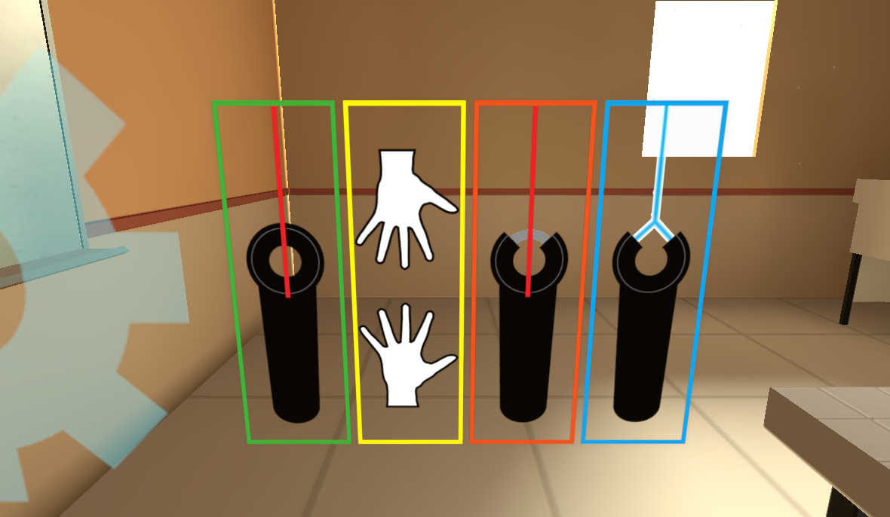
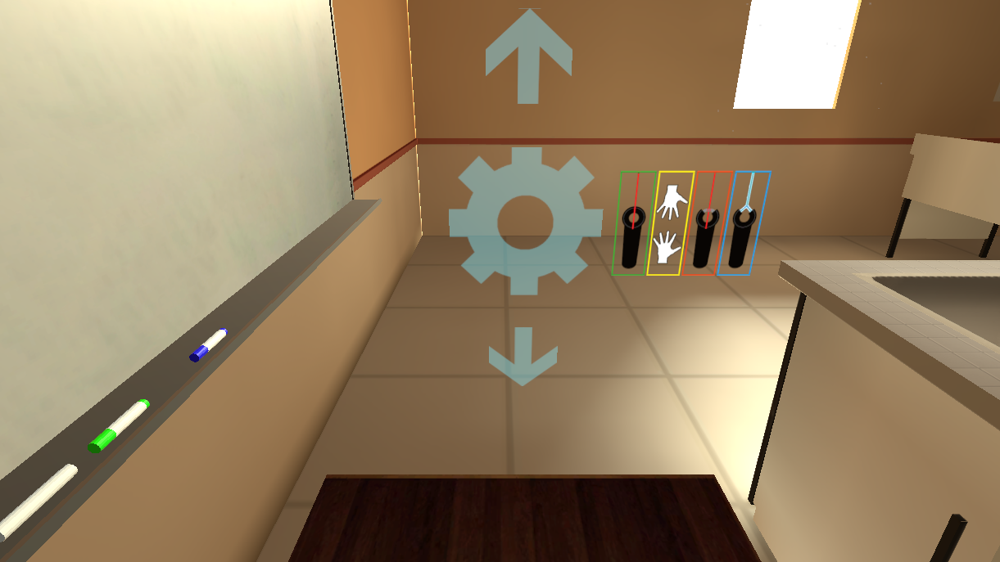
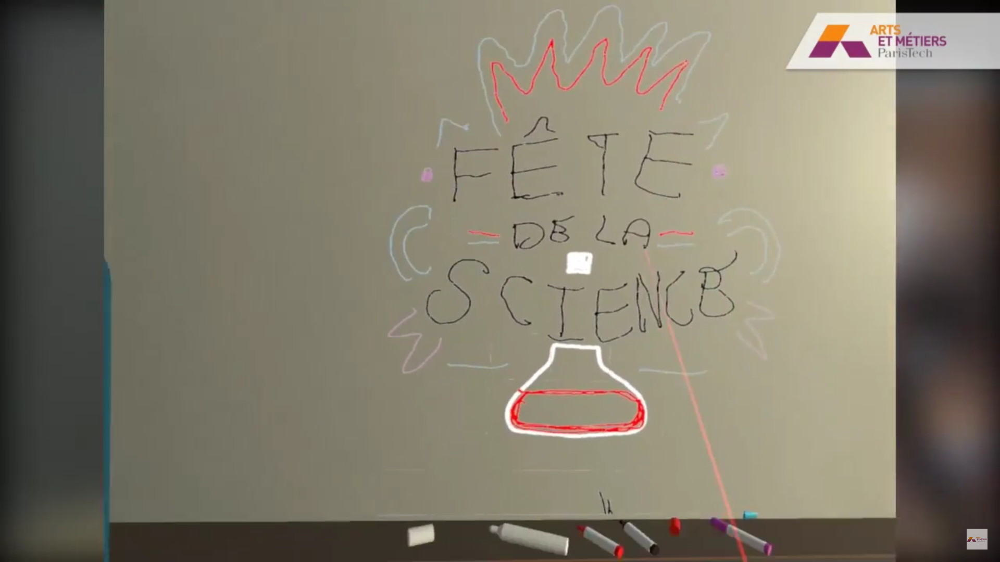
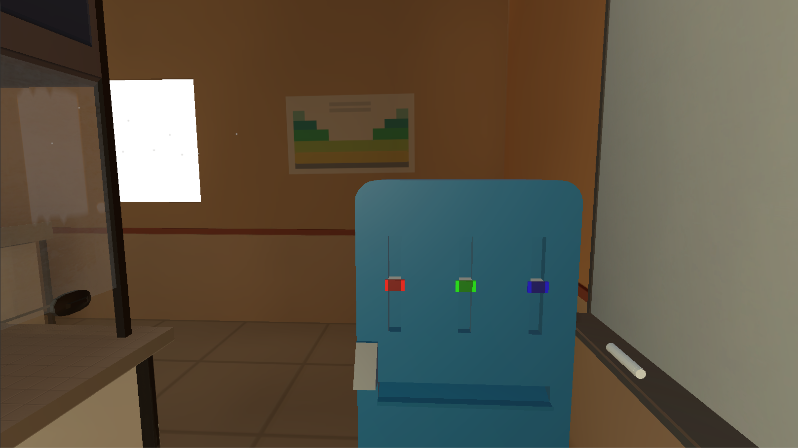

# Dactylea

Dactylea is a didactic chemistry simulation in VR. With the help of Fabienne, Dactylea's AI, make a Pharao's Serpent.  
You can talk to Fabienne, she may not understand everything but she will do her best to help you. For example, you can ask her to repeat the last instructions or to explain you what you should do next.  
Be careful when manipulating chemicals, Ethanol burns and glass breaks. You have to finish the simulation without doing any mistake !  

Dactylea was made for the [LAMPA laboratory](http://lampa.ensam.eu/).  
Here is the [presentation video (on Youtube)](https://www.youtube.com/watch?v=ghqWI-w7M_k).  

Most graphical elements were made by [Emilien Grude](https://www.artstation.com/scraick).  

## Table of contents
[The simulation](#the-simulation)  
[Fluid simulation](#fluid-simulation)  
[Other interactions](#other-interactions)  
* [Voice recognition](#voice-recognition)  
* [Controller selection](#controller-selection)  
* [Elevating platform](#elevating-platform)  
* [Whiteboard drawing](#whiteboard-drawing)  
[Illustrations](#illustrations)  

## The simulation
The goal of the player is to produce a Pharao's serpent, which requires some chemistry. Most interactions are here to allow the player to realise the experimental protocol.  
Here are some of these interactions:  
* Containers (such as Erlenmeyers) can contain Compounds, which are made of some of the chemicals available. Players can mix chemicals, which can then react to produce a new chemical.
If the player tries to run liquids, the liquid will exit the container, bit by bit, and if an other container receives the liquid, it will fill it.  
* Some reactions require heat or agitation, the agitator is here to do that. The agitator is both able to agigate and heat erlemeyers.  
* Corks : Erlenmeyers have corks, some chemicals are toxic or can explode when in contact with air and corks are here to protect the player.  
* Matches : The final reaction requires fire, the player can light it up by rubbing it against the matchbox.  
* Spoon : Before igniting the powder to start the final reaction, the player has to flatten the heap with the spoon.  
* Sinks : While water is not required, having a fully fonctional sink was important for the quality of immersion. If the player fills the sink faster than the sinks can empty itself, liquids will also appear in the sink.
Also, the more it is filled, the quicker it will empty itself.  

Here is the experimental protocol:  
1) Put 15mL of nitric acid in a graduated beaker  
2) Using the pipette, put 0.3mL of elemental mercury inside the same beaker  
3) Put the beaker of the magnetic agitator and wait for the end of the reaction.  
4) Pour 4g of diluated potassium in the beaker, put it back on magnetic agitator and wait for the deposit.  
5) Remove the liquid from the beaker (by putting it in another beaker or in the sink) while taking care of keeping the powder in the first beaker.  
6) Put the powder on the cup and wait for it to dry.  
7) Crack a match and ignite the powder.  
8) Enjoy !  

## Fluid simulation
Liquids simulation was made with a method I developed. While it is not impressive, it is convincing (and immersive) while having a very low impact on performance.  
Basically, I interpolate the height of the liquid inside the container from the container's rotation and the volume it contains.  
I wrote a paper which detailes further this method called "Interpolation of liquids' height inside a mesh" (DOI : 10.1145/3110292.3110315, not available yet).  

## Other interactions
### Voice recognition
Voice recognition was achieved by using Microsoft's API with :
```csharp
using UnityEngine.Windows.Speech;
```
This API "only" does Keyword recognition, not Speech-to-Text.  
In this simulation, Fabienne understands the following commands:  
* Tell the previous/next instructions of the experimental protocol  
* Pause/Remuse  
* Repeat  
* Be quiet  
* Change the models of the controllers  
* Show the pen distributor  

### Controller selection
The user has the choice between 4 controllers, each controller is there to improve immersion, trying to explain interactions in different ways:  
* Default controller  
* Hands  
* Default controller with Claws  
* Default controller with Laser beam  

### Elevating platform
It was decided during development to present this project at the Science Festival. We wanted children to be able to participate, to keep it immersive, we added a platform that can rise up.  

### Whiteboard drawing
There was a whiteboard since ealy development, we wanted to scene to feel more "complete" so we added pens and interaction to be able to draw on the whiteboard.  
By default, you only have few pens but you can ask Fabienne to bring you the pen distributor, allowing you to make any color (using RGB). Be careful not to flood the floor with too many pens, it may slow down the program at some point !  
The technique I used for whiteboard is not very good and I didn't have time to update it. If you're interested  in Texture painting, you should check [this tutorial](http://codeartist.mx/tutorials/dynamic-texture-painting/).

## Illustrations

* Dactyla, the setup:  


* Chemicals:  


* The magnetic agitator:  


* The result of the simulation, the Pharao's Serpent:  


* Diethyl ether exploding:  


* Select your favorite controller:  


* Too small ? Rise the platform:  


* Draw on the whiteboard:  


* Need more pens ? Here is a pen distributor:  
